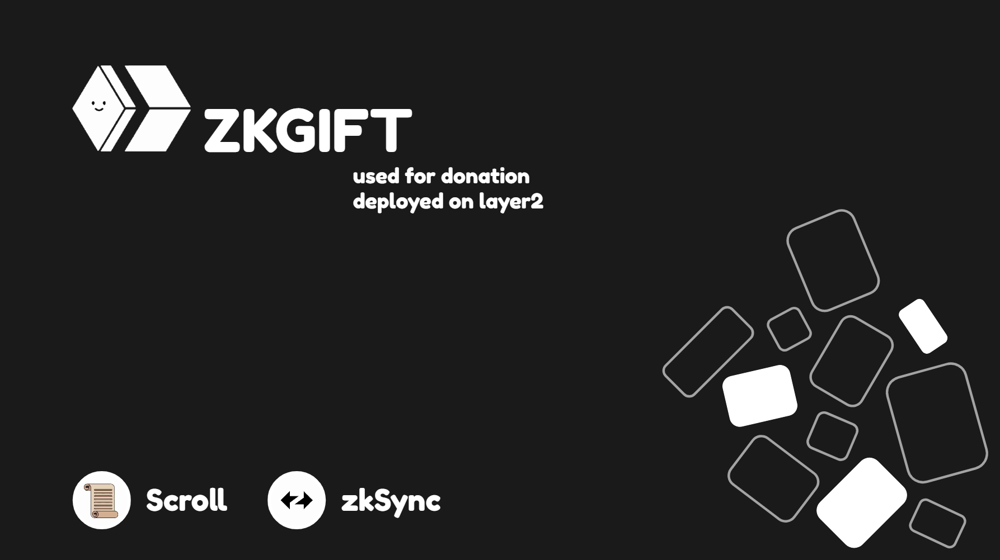
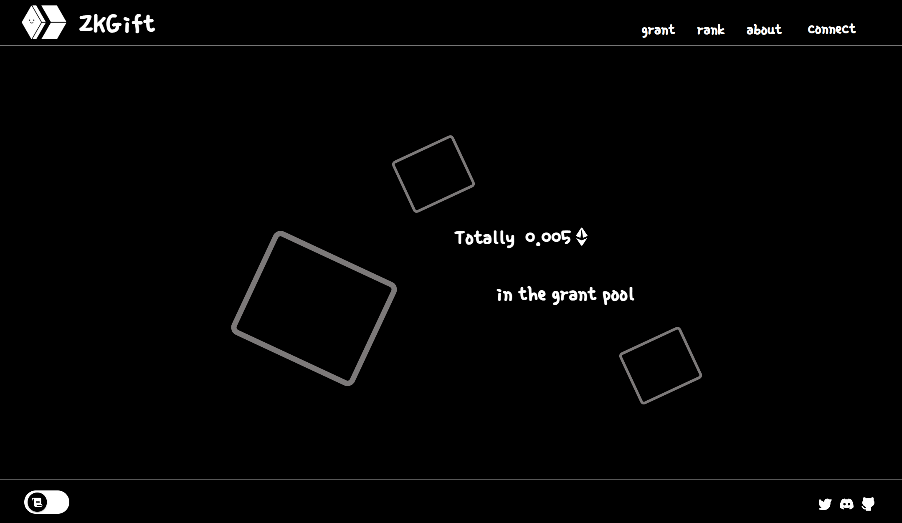
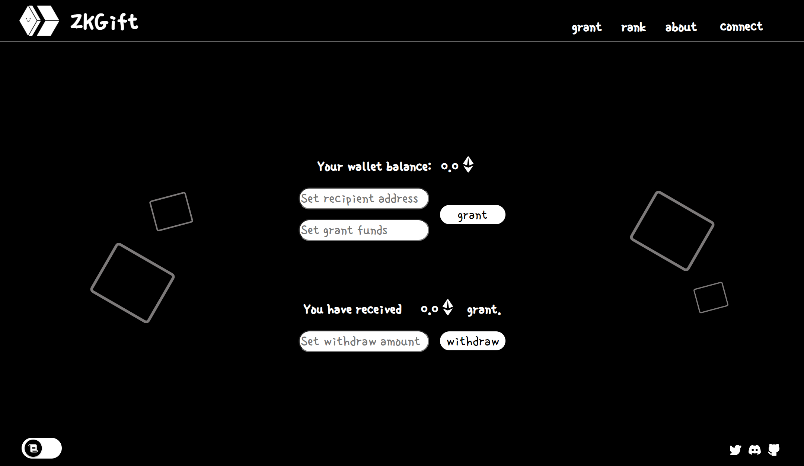
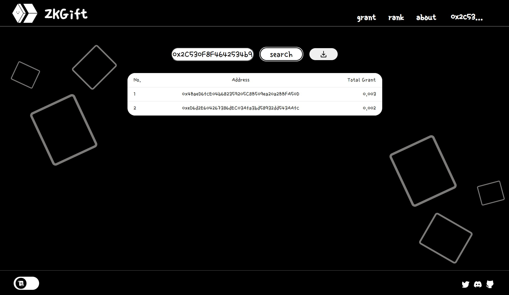
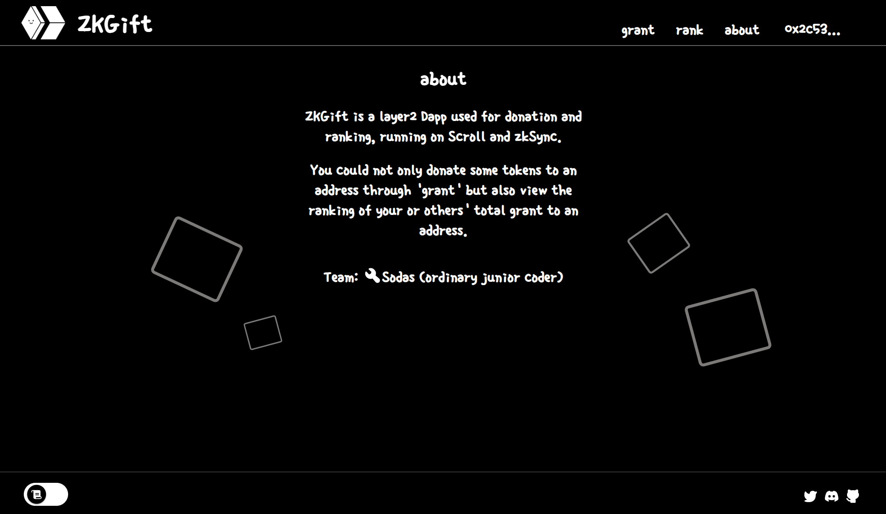

# ZKGift

#### 简介：

​	部署在zkSync和Scroll以太坊二层侧链上的Dapp，用于打赏捐赠和排名记录。

​	A layer2 Dapp used for donation and ranking, running on Scroll and zkSync. 

#### 概述：

​	只需要一个准确的地址，可以是打赏给喜爱的内容博主，用户便能即刻向对方捐赠token，无需复杂的操作，通过智能合约确保捐赠记录公开透明，并形成简洁直观的捐赠排行榜。

​	ZKGift的主要目标用户是[大量的粉丝群体]/[KOL]/[项目方]，为他们提供一个高效的无验证捐赠平台，完全根据个人意愿进行捐赠或回礼，界面风格简单易用，用户在任何时间，只需输入收款地址和金额即可直接捐赠，同时生成直观完整的捐赠排行榜。

​	输入受赏者地址可以检索到对应的捐赠排行榜，可以看到所有的捐赠者地址和各自的总捐赠金额。捐赠记录存储在映射中，数据公开透明，任何时刻都可查看。捐赠者可以实时查看他们对于某地址的捐赠排名，受赏者可以随时导出排行榜信息文件(address.csv)，也许可以依据排名，向捐赠者回赠对应的NFT空投或实体礼物。

#### 整体设计：

​	[展示链接](https://miro.com/app/board/uXjVMWr_fNo=/?share_link_id=570415314609)

#### Demo演示：

​	(制作中)

#### 项目截图：

HomePage

GrantPage

RankPage

AboutPage

